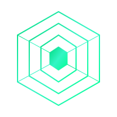

# Roadmap - Docs Denck

<div align="center">
  
  <h1 style="color: #00DC82; text-shadow: 0 0 10px #00DC82;">Docs Denck</h1>
  <p style="color: #6B7280;">Roadmap de desenvolvimento da plataforma</p>
</div>

---

## Visão Geral

Este roadmap define as etapas de desenvolvimento e evolução da plataforma **Docs Denck**, uma solução moderna de documentação técnica construída com Nuxt 3.

---

## Objetivos Principais

- **Plataforma Base**: Interface minimalista com tema verde neon
- **Sistema de Documentação**: Múltiplos templates (docs, lab, knowledge, cheatsheet)
- **Autenticação GitHub**: Login via OAuth2 com controle de acesso
- **Deploy Automatizado**: CI/CD completo com GitHub Actions
- **Monitoramento**: Logs e métricas de uso
- **Performance**: Otimizações e cache

---

## Fases de Desenvolvimento

### **Fase 1: Fundação** - *Concluída*
- [x] Setup inicial do projeto Nuxt 3
- [x] Configuração Nuxt UI + TailwindCSS
- [x] Sistema de templates de documentação
- [x] Tema visual com cores personalizadas
- [x] Estrutura de conteúdo em Markdown
- [x] Navegação e sidebar dinâmica

### **Fase 2: Autenticação** - *Em Progresso*
- [x] Estrutura OAuth2 GitHub preparada
- [ ] Integração completa OAuth2 GitHub
- [ ] Sistema de sessões persistentes
- [ ] Middleware de autorização
- [ ] Dashboard de usuário

### **Fase 3: DevOps & Deploy** - *Em Progresso*
- [x] Configuração Git com LF (Linux)
- [x] Estrutura de branches (main, dev, build, test, sec)
- [x] GitHub Actions para CI/CD
- [ ] Deploy automatizado em servidor Linux
- [ ] Versionamento automático com tags
- [ ] Pre-releases automatizadas

### **Fase 4: Conteúdo & Features** - *Planejada*
- [ ] Expansão da base de conhecimento
- [ ] Sistema de busca avançada
- [ ] Comentários em documentos
- [ ] Histórico de versões
- [ ] Export para PDF

### **Fase 5: Performance & Monitoramento** - *Planejada*
- [ ] Otimização de performance
- [ ] Sistema de cache Redis
- [ ] Monitoramento com Prometheus
- [ ] Analytics de uso
- [ ] SEO otimizado

---

## Stack Tecnológica

### **Frontend**
- **Nuxt 3**: Framework Vue.js full-stack
- **Nuxt UI**: Componentes UI modernos
- **TailwindCSS**: Framework CSS utilitário
- **Nuxt Content**: Sistema de CMS baseado em Markdown

### **Backend**
- **Express.js**: API REST para autenticação
- **Axios**: Cliente HTTP para integrações
- **GitHub OAuth**: Sistema de autenticação
- **JWT**: Tokens de autenticação

### **DevOps**
- **GitHub Actions**: CI/CD pipeline
- **Docker**: Containerização
- **Nginx**: Reverse proxy
- **PM2**: Process manager Node.js

---

## Timeline

| Período | Fase | Status |
|---------|------|--------|
| **Março 2026** | Fase 1 - Fundação | Concluída |
| **Março 2026** | Fase 2 - Autenticação | Em Progresso |
| **Abril 2026** | Fase 3 - DevOps | Em Progresso |
| **Maio 2026** | Fase 4 - Conteúdo | Planejada |
| **Junho 2026** | Fase 5 - Performance | Planejada |

---

## Design System

### **Cores Principais**
```css
--primary: #00DC82      /* Verde Nuxt */
--background: #0B0F10   /* Preto profundo */
--surface: #111827      /* Cinza escuro */
--border: #1F2937       /* Cinza médio */
--text: #F3F4F6         /* Branco suave */
```

### **Tipografia**
- **Títulos**: Font weight 700, text-shadow sutil
- **Corpo**: Font weight 400, line-height 1.6
- **Código**: Fonte monospace, background destacado

---

## Configurações Técnicas

### **Ambiente de Desenvolvimento**
- Node.js 20+
- Git com LF (Linux line endings)
- VS Code com extensões Vue/Nuxt

### **Produção**
- VPS Linux (Ubuntu/Debian)
- Nginx como reverse proxy
- SSL/TLS com Let's Encrypt
- Monitoramento com logs

---

## Métricas de Sucesso

- **Performance**: Lighthouse score > 90
- **SEO**: Core Web Vitals otimizados
- **Usabilidade**: Tempo de carregamento < 2s
- **Conteúdo**: +100 documentos técnicos
- **Engagement**: Analytics de uso

---

## Contribuição

Este é um projeto pessoal, mas sugestões são bem-vindas:

1. Abra uma issue para discussão
2. Fork o repositório
3. Crie uma branch para sua feature
4. Faça commit das mudanças
5. Abra um Pull Request

---

## Notas de Versão

### **v1.0.0** - *Março 2026*
- Plataforma base funcional
- Sistema de templates
- Tema visual personalizado
- Estrutura de conteúdo

### **v1.1.0** - *Planejada*
- Autenticação GitHub
- Deploy automatizado
- Sistema de busca

---

<div align="center">
  <p style="color: #6B7280; margin-top: 2rem;">
    Desenvolvido com <svg width="16" height="16" fill="#00DC82" viewBox="0 0 24 24"><path d="M12 21.35l-1.45-1.32C5.4 15.36 2 12.28 2 8.5 2 5.42 4.42 3 7.5 3c1.74 0 3.41.81 4.5 2.09C13.09 3.81 14.76 3 16.5 3 19.58 3 22 5.42 22 8.5c0 3.78-3.4 6.86-8.55 11.54L12 21.35z"/></svg> por <strong style="color: #00DC82;">Ranlens Denck</strong>
  </p>
</div>